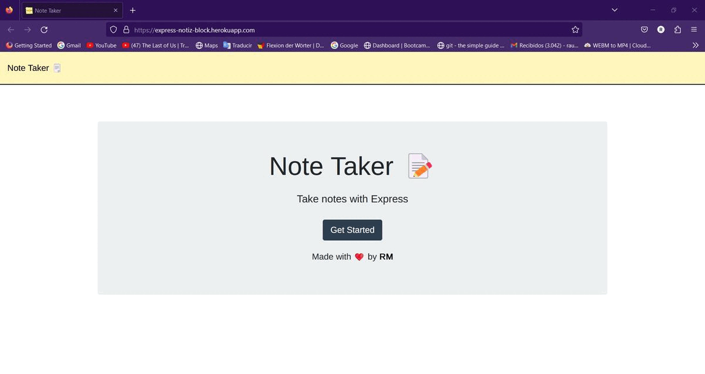

<!-- PROJECT LOGO -->
 

  

  <h2 align="center">Note Taker Application</h2>
  <h4 align="center">Express.JS</h4>

---

 

    
    
    

 

This Note Taker App project is a simple note-taking application built using Node.js and the Express.js framework. The application allows users to create, view, and delete notes, and all notes are stored in a JSON file.
     
     
    <a href="https://github.com/RaulMaya/Notes-App">Repository</a>    
    ·
    <a href="https://express-notiz-block.herokuapp.com/">Deployment</a>
    ·
    <a href="https://www.linkedin.com/in/raul-maya/">My LinkedIn</a>

  

### Content Table
* [About](#about)
* [Usage](#usage)
* [Walkthrough](#walkthrough)
* [License](#license)
* [Contact](#contact)

### About

The application is organized into two main parts: the server-side code and the client-side code. The server-side code is responsible for handling HTTP requests and responses, processing user input, and managing the notes stored in the JSON file. The client-side code is responsible for displaying the user interface and sending requests to the server-side code via HTTP.

The server-side code uses Express.js to create an HTTP server and handle routes for creating, reading and deleting notes. The notes are stored in a JSON file using the fs module provided by Node.js.

The client-side code is built using HTML, CSS, and JavaScript, and uses fetch() to make requests to the server-side code. The user interface is simple and intuitive, with a sidebar that displays all the notes and a main area that displays the content of the selected note.

Overall, the Notes-App project is a great example of a simple yet effective note-taking application built using Node.js and the Express.js framework. It can be used as a starting point for building more complex applications or as a learning resource for those new to web development with Node.js.

### Usage

The usage of this application is to provide users with a simple and intuitive interface for creating, viewing, editing, and deleting notes. The application allows users to keep track of their thoughts and ideas in an organized manner and to access them from any device with an internet connection.

### Walkthrough

### License

> You can check out the full license [here](https://github.com/IgorAntun/node-chat/blob/master/LICENSE)
> This project is licensed under the terms of the **MIT** license.

### Contact

- Name: Raul Maya Salazar
- Phone: +52 833 159 7006
- E-mail: raulmayas20@gmail.com
- GitHub: https://github.com/RaulMaya
- LinkedIn: https://www.linkedin.com/in/raul-maya/

(<a href="#top">back to top</a>)

